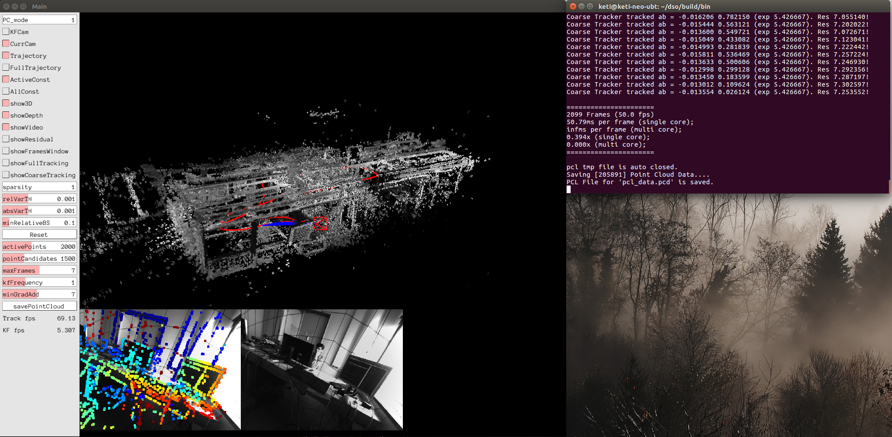

# Direct Sparse Odometry with Saving Point Cloud Data
DSO with additional function for saving point cloud data. You can use it to show point cloud which made from DSO on 3D viewer like Mesh Lab or OpenGL, VTK. It can save point cloud data as a PCD file.

## Installation
You can install it to follow https://github.com/JakobEngel/dso.

## Usage
It also same thing https://github.com/JakobEngel/dso. It can use DSO on using dataset or realtime ROS.
To use DSO with saving Point cloud data, You just add parameter option for sampleoutput.

     bin/dso_dataset \
			files=XXXXX/sequence_XX/images.zip \
			calib=XXXXX/sequence_XX/camera.txt \
			gamma=XXXXX/sequence_XX/pcalib.txt \
			vignette=XXXXX/sequence_XX/vignette.png \
			preset=0 \
			mode=0 \
               sampleoutput=1
 
 And press the 'Save PointCloud' button when you want to save point cloud data.
 
 
 
 #### Ask any issues via Github or contacting neoplanetz@gmail.com
